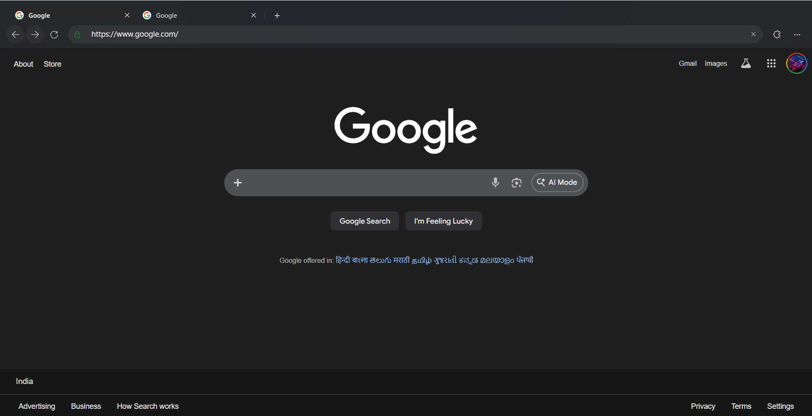

# 🌐 VBrowser

**The modern, vibecoded web browser built for speed, aesthetics, privacy, and exceptional RAM management.**

*VBrowser combines sleek WinUI 3 aesthetics with the power of WebView2 to deliver a premium browsing experience that feels lightweight and native.*

---

---

## ✨ Key Features

- 🚀 **Blazing Fast & Lightweight**: Powered by the modern Microsoft Edge WebView2 control, ensuring top-tier performance, security, and rendering compatibility.
- 🧠 **Superior RAM Management**: Engineered for extreme memory efficiency, specifically designed to consume considerably less RAM than Google Chrome—keeping your system snappy even with multiple tabs open.
- 🎨 **Fluid & Premium UI**: Built with WinUI 3 to deliver smooth, GPU-accelerated animations. Tab switching, sidebar toggling, and address bar interactions feel incredibly responsive and "alive".
- 🛡️ **Built-in Adblocking** *(Coming Soon)*: Native adblocking is currently in development to bring you a distraction-free web without relying on heavy third-party extensions.
- 🕵️ **Private Browsing Mode**: Leave no trace. Private tabs use an ephemeral, in-memory browsing context that saves zero history, cookies, or site data.
- 📥 **Integrated Download Manager**: Easily track, manage, and open your downloaded files directly within the browser's sleek UI.
- 📖 **Seamless History Management**: Quickly search and navigate your localized browsing history.
- ⚙️ **Customizable Settings**: Tailor your browsing experience exactly to your vibe.

## 🛠️ Technology Stack

- **C# & .NET 9**: Robust, memory-safe backend architecture.
- **WinUI 3 (Windows App SDK)**: Delivering modern Windows 11 design paradigms natively, including Mica material and smooth Composition API animations.
- **WebView2**: The underlying Chromium-based core for rendering modern web standards.

## 🚀 Installation & Download

1. Navigate to the **[Releases](https://github.com/varun875/VBrowser/releases/latest)** page on this repository.
2. Download the latest `.msix` package.
3. Double-click the file to install it easily and securely using the built-in Microsoft App Installer.

*(Note: VBrowser runs on Windows 11 and requires the Windows App SDK runtime).*

---

<em>Vibecoded for the absolute best browsing experience.</em>

